# About me

My name is Adrian Kwiatkowski and I have been working as an iOS Developer since 2018. During this time, I have worked on a number of projects across different business areas (mainly shopping, social, utility and telecom apps).
I value working in teams that prize effectiveness and simplicity, and I have a soft spot for modern, minimalistic design and good user experience.

My commercial iOS development journey started in a company that manages the largest shopping/coupon apps in Poland, where I gained experience working on large-scale apps (100k+ MAU). During that time, I also learned to work with tools such as Firebase, Realm, and fastlane. This was also where I learned to work with Scrum and Kanban. Then, for around 1.5 years, I worked in a software house and learned the basics of reactive programming (RxSwift) and also expanded my skills in application architecture.

In the beginning of 2021, I moved to Copenhagen and started working at Jayway (later Devoteam Creative Tech) on the GN Kai project - a companion app that helps onboard users to a new hearing-aid experience. This app was written entirely in SwiftUI, which back then was still a fairly new UI framework from Apple. Later that year, I joined the Jabra Sound+ team, where I learned the basics of Swift Concurrency (async/await).

Since 2023, I have been a part of Too Good To Go, where we focus on minimizing food waste around the world. I started on the product team, and since early 2025 I've been on **Foundation** - the platform team - co-leading the iOS side of the company-wide design system.

Personally, I am friendly and easy-going. I also enjoy an eco-friendly, zero-waste lifestyle, a mindful approach to life, and all kinds of animals.

## Contact info

- [kwiatkowski.adrian@icloud.com](mailto:kwiatkowski.adrian@icloud.com)
- [linkedin.com/in/adrian-kwiatkowski](https://www.linkedin.com/in/adrian-kwiatkowski/)

### Quick jump to:
- [Skills](#skills)
- [Apps](#apps)
- [Companies](#companies)
- [Education](#education)

# Skills

**Languages**: Swift 6 (strict concurrency, actors, Sendable, @MainActor)

**Apple frameworks**: SwiftUI, UIKit, Combine, async/await, CoreData, CoreBluetooth, CallKit, PushKit, Contacts, AVFoundation, QuickLook

**Third-party libraries**: RxSwift, RxCocoa, Realm, Alamofire, Moya, Firebase, SnapKit

**Architecture**: Clean Architecture, MVVM, VIPER, MVC, State Machine, unidirectional data flow, SOLID, Dependency Injection, modularization, Protocol-Oriented Programming

**Testing**: TDD, unit / integration / UI / snapshot / smoke tests, Xcode test plans, Swift Testing, XCTest, swift-snapshot-testing, Quick & Nimble

**Build & CI/CD**: Swift Package Manager, CocoaPods, Carthage, fastlane, SwiftLint, GitHub Actions, Swift API digester

**Design systems**: Style Dictionary, Figma Code Connect, design tokens, multi-mode theming, internationalization (Crowdin)

**Accessibility**: VoiceOver, Dynamic Type

**AI tooling**: Claude Code, multi-agent workflows

**Process & collaboration**: Git, Scrum, Kanban, GitHub, Bitbucket, GitLab, JIRA, Confluence

# Apps

## [Too Good To Go](https://apps.apple.com/app/too-good-to-go-end-food-waste/id1060683933)

Too Good To Go makes it easy to make a positive impact on the planet while saving money on your favourite foods.
That's why it's been named as Winner in the '2023 Cultural Impact' category at the prestigious annual Apple App Store Awards. With the #1 app for reducing food waste, you can save tasty unsold snacks, takeaway meals and ingredients straight from shops, cafes, grocery stores and restaurants in your area - all at an unbeatable price.

My contributions have spanned product work (features like the charity module) and, since early 2025, design system + developer-experience work on the **Foundation** platform team.

What I've learned:

- co-leading the iOS side of an **org-wide design system** - distributed as a Swift Package with SwiftUI components, tokens, and theming, on **Swift 6** with strict concurrency
- **Style Dictionary** token pipeline generating Swift, Android, and web outputs from a single Figma source
- **Figma Code Connect** to bridge design and code at build time
- **Swift API digester** for automated semver detection in design-system releases
- **swift-snapshot-testing** with dedicated `xcodebuild` test plans in CI
- **Claude Code** with multi-agent workflows in daily work

  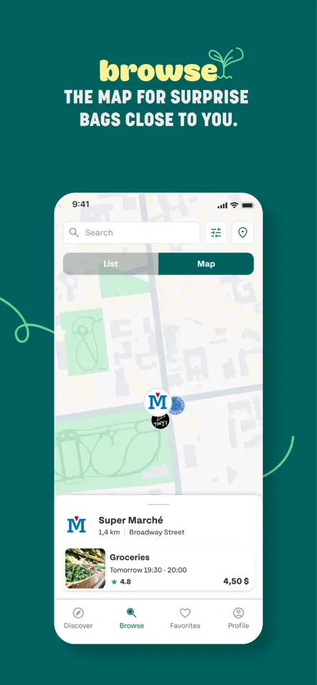
  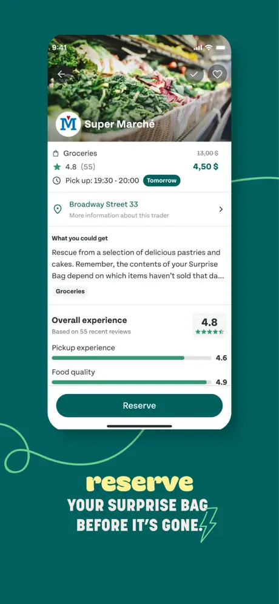
  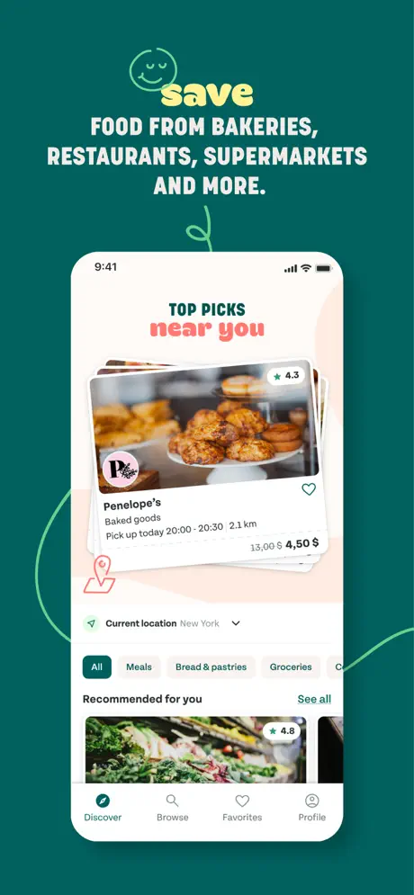

 

## [Jabra Sound+](https://apps.apple.com/app/jabra-sound/id1320805565)

The Jabra Sound+ app is the perfect companion for your Jabra headphones - adding extra features and enabling you to personalize the way you use your Jabra headphones.

I was a part of a team of 10+ iOS developers working on a large codebase. I was responsible for maintaining the old code, adding new features and support for new devices.

What I've learned:

- basics of bluetooth connectivity and communication using **GaiaSDK**, **GNP** and **CoreBluetooth**
- writing code that uses **async/await**
- working in a large product team (30+ people)

  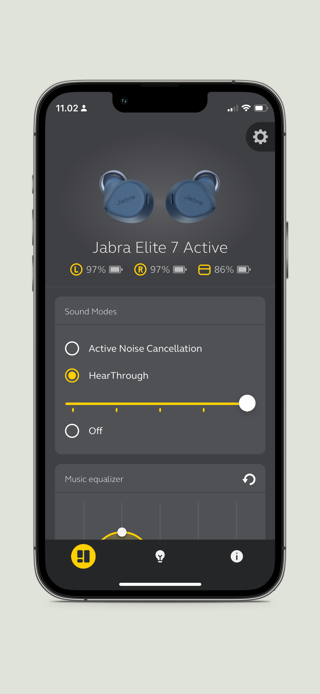
  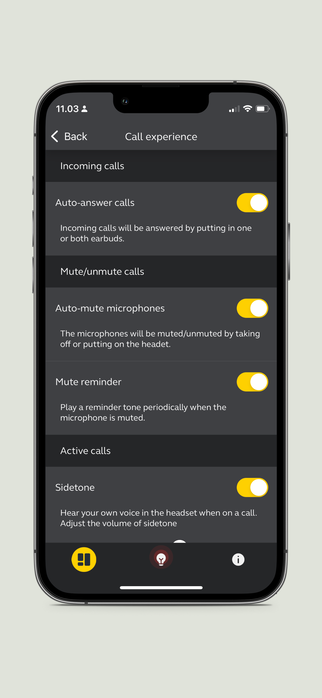
  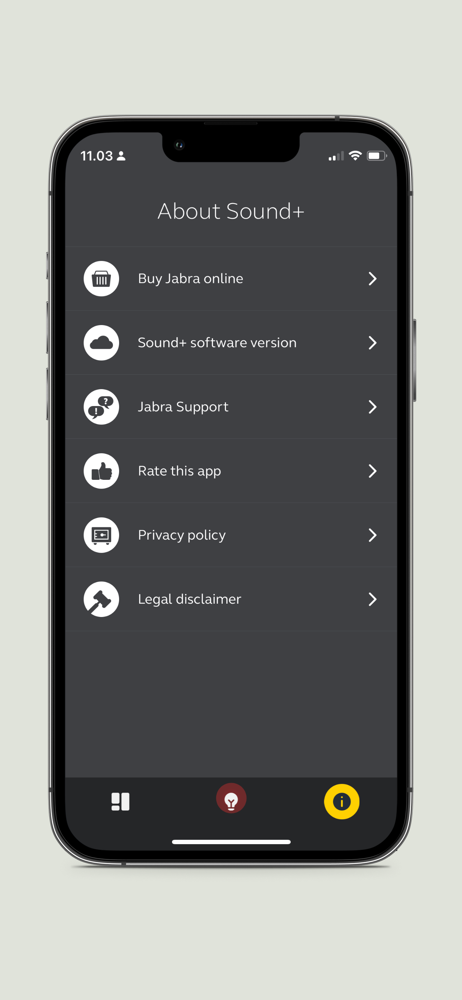

 

## Folketinget

An app which allows the members of the Danish Parliament to better manage their everyday activities and obtain the right information for the meetings and committees they attend. This was an iPad only app.

What I've learned:

- basics of **VIPER** architecture
- working with documents using **QuickLook**
- making **SOAP requests** with iOS networking API

*Screenshots unavailable due to NDA.*

 

## Kai

New onboarding solution to help new hearing aid users adapt to their new lives and to get familiar with their new devices. **Azure** cloud was used for backend. App content and user journeys managed in an open source **headless CMS (Strapi)**.

The iOS version of the app was written entirely using **SwiftUI** and **Combine**.

What I've learned:

- working with **State Machine** concept
- using **SwiftUI** to create views
- **Combine** framework to pass the data between components

  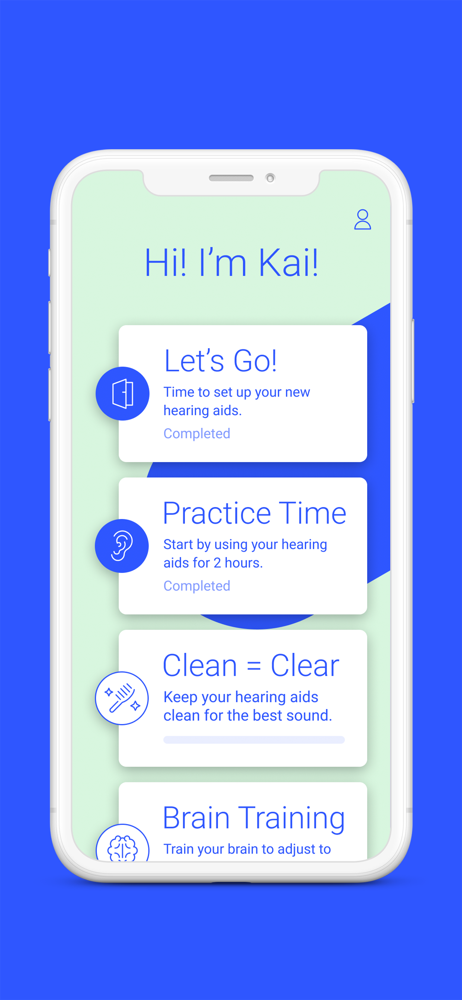
  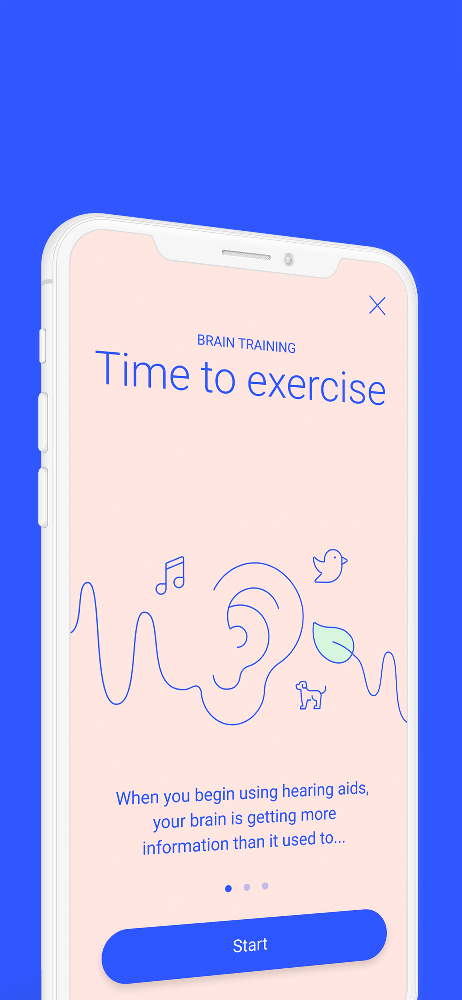
  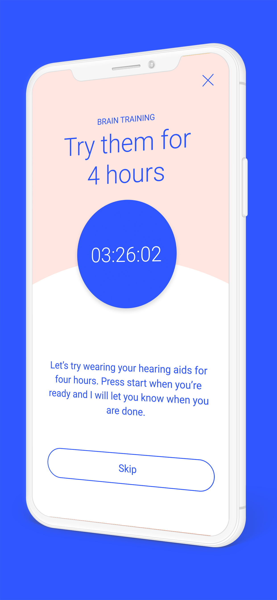

 

## Obostrzenia

The app was supposed to show the current governmental restrictions (caused by COVID-19 pandemic) in Poland, based on user's location. Together with my friend, we created the **MVP** in **Flutter** and submitted it to the App Store and Google Play.

Unfortunately - due to the fact that this was a personal project rather than one from a recognized institution (such as a governmental entity or hospital) - it got rejected, so we decided to abandon the project.

What I've learned:

- writing simple apps using **Flutter**
- **geolocator** to fetch user's location data
- **permission_handler** to work with user's permissions

  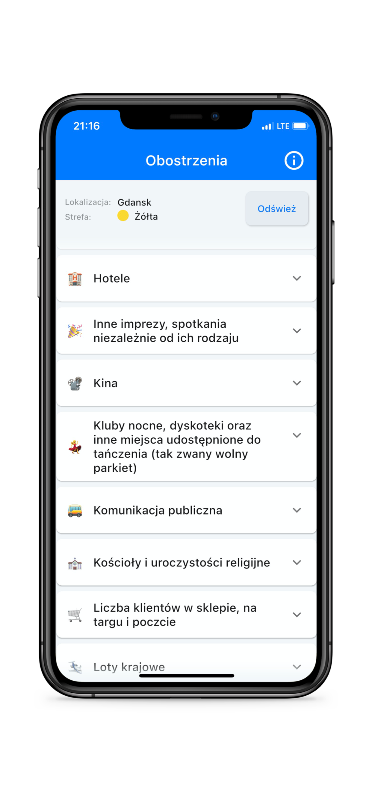
  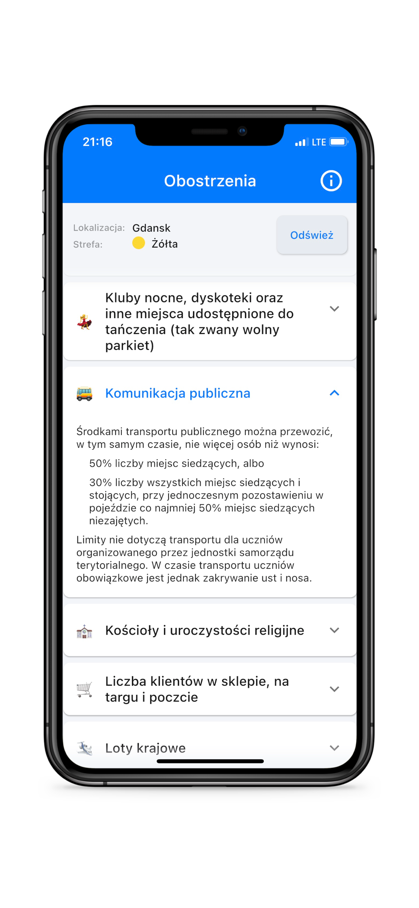

 

## [HiHi Connect 2](https://apps.apple.com/app/hihi-connect-2/id1532249807)

Application that allows audio and video calling using **Session Initiation Protocol (SIP)**. Users can also store contacts, synchronize them and view their presence (using **XMPP**).

For the first few months of this project I was the only iOS Developer, learning the responsibilities and tradeoffs of being a solo developer.

What I've learned:

- integrating **PushKit** into the project to receive VoIP notifications
- working with **CallKit** to handle CXActions
- **Contacts Framework** to access and display contacts stored on the device
- **CoreData** to store and synchronize data fetched from the API (company contacts, calls history)
- **linphoneSDK** - a library that integrates SIP voice/video features

  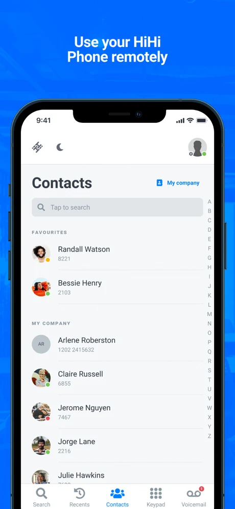
  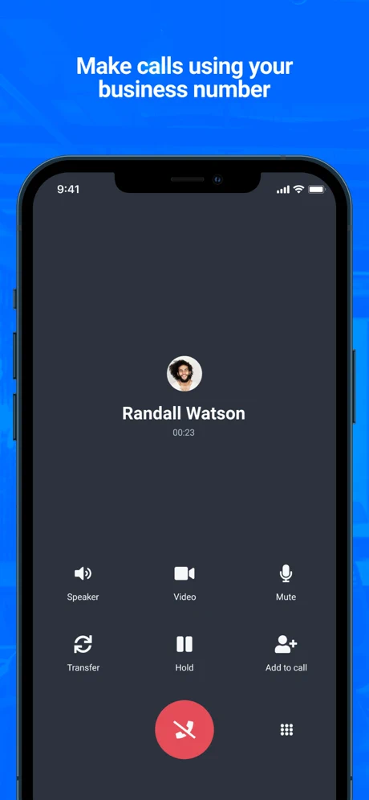
  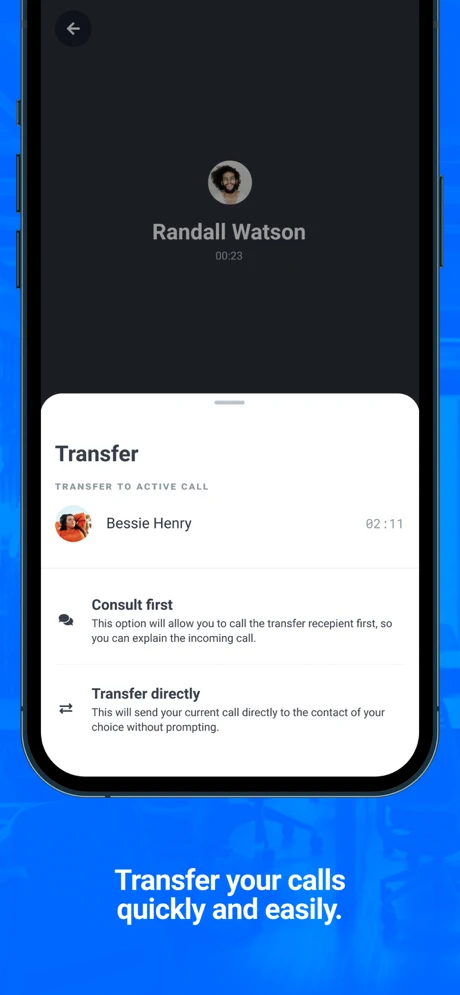

 

## Social Networking App

This project was a social network app that allows users to search for groups related to their interests/hobbies and post text, images, videos and links based on their permissions/group access.

What I've learned:

- unidirectional data flow using **Moya**, **Realm** and **RxSwift**
- writing **unit tests** with **Quick** and **Nimble**
- basics of **AVFoundation** to play video
- **UIImagePickerController** to post images
- protocol-oriented programming (POP)

*Screenshots unavailable due to NDA.*

 

## Seaber

An award-winning IoT mobile app which allows boat owners to be notified of unauthorised movement of their vessels, with sophisticated map integration and social networking features.

I joined the project a few months before launch and was involved during the process of submitting it to the App Store, as well as some time after for post-release maintenance.

What I've learned:

- **MVVM** architecture
- first experience with **RxSwift** and **RxCocoa**
- **SnapKit** as a DSL for **AutoLayout**
- implementing **Stripe** payments

  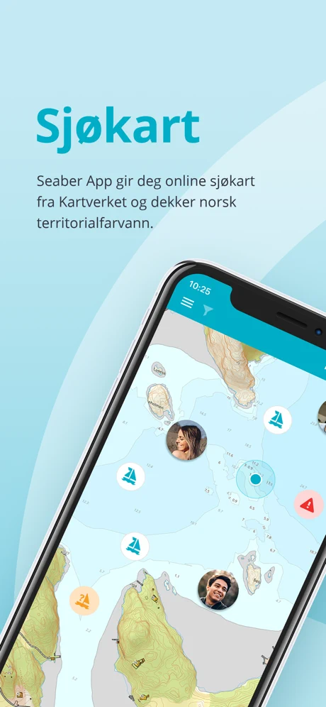
  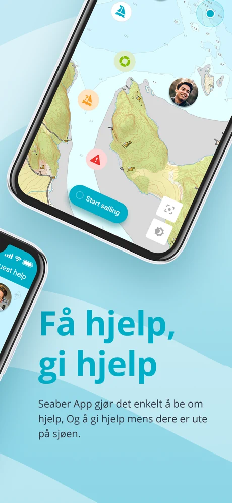

 

## [Zdrowe Zakupy](https://apps.apple.com/pl/app/zdrowe-zakupy/id1200020785)

Zdrowe Zakupy is an application that helps you buy products that do not contain harmful ingredients. After scanning the product's barcode, you can check the specific ingredients and their possible harmfulness.

This was my first chance to work on a project from beginning to launch. Even though it was an app with an established userbase, we decided to start this one from scratch due to the many bugs in the legacy code.

What I've learned:

- writing **unit tests** in **XCTest**
- scanning barcodes using **AVCaptureMetadataOutput**
- implementing **Rewarded Video Ads**
- the process of submitting a new app to the **App Store**

  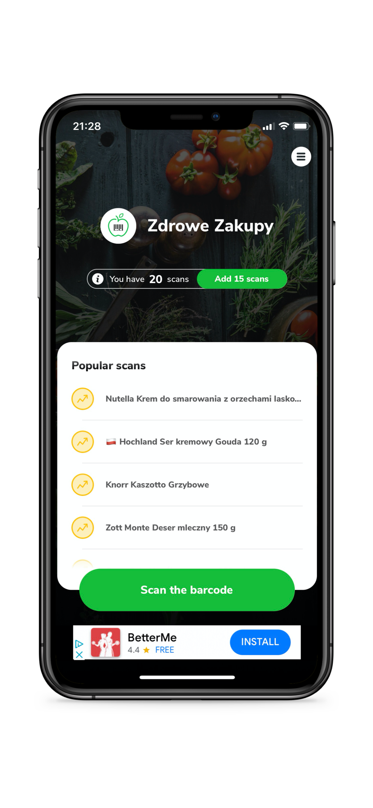
  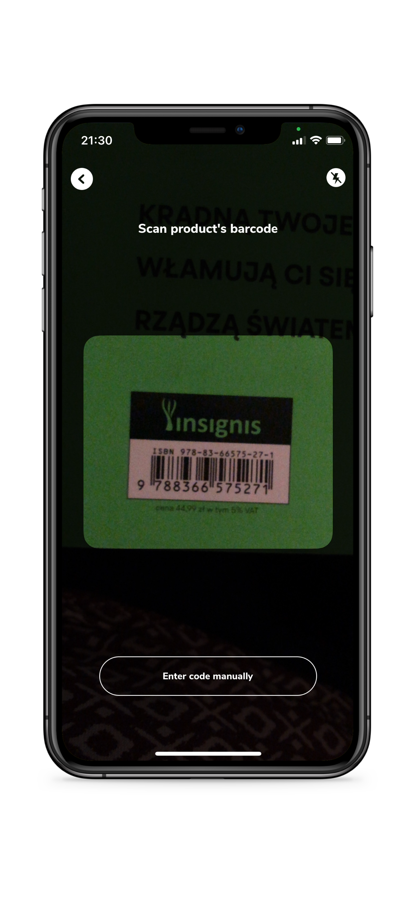
  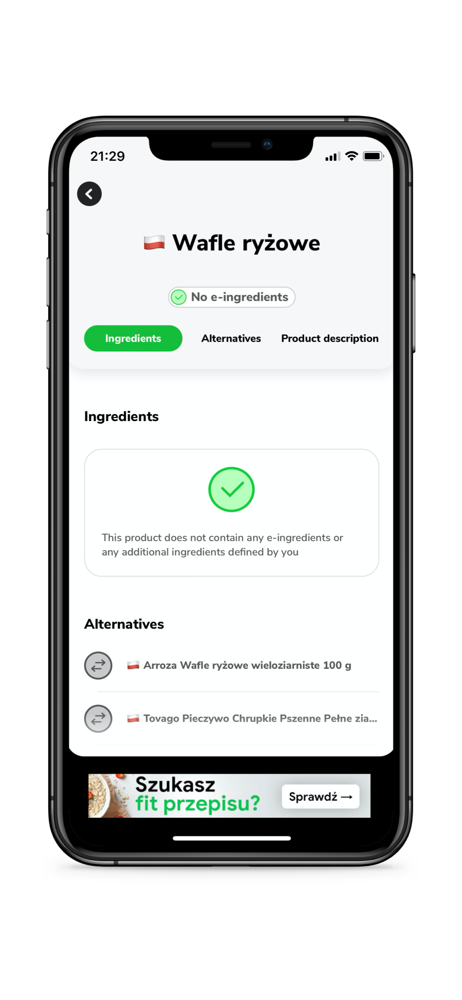

 

## [Qpony](https://apps.apple.com/app/qpony-promocje-kupony-zniżki/id585176404)

The most popular discount app in Poland. The best and most up-to-date coupons and leaflets in one application. Here you will find a database of coupons, sales, discounts and promotional leaflets for popular retail chains.

What I've learned:

- network communication with **API** using **Alamofire**
- Push Notifications
- working efficiently with **Git**
- becoming more familiar with **CocoaPods**
- working with analytic tools like **Crashlytics** and **Clevertap**

  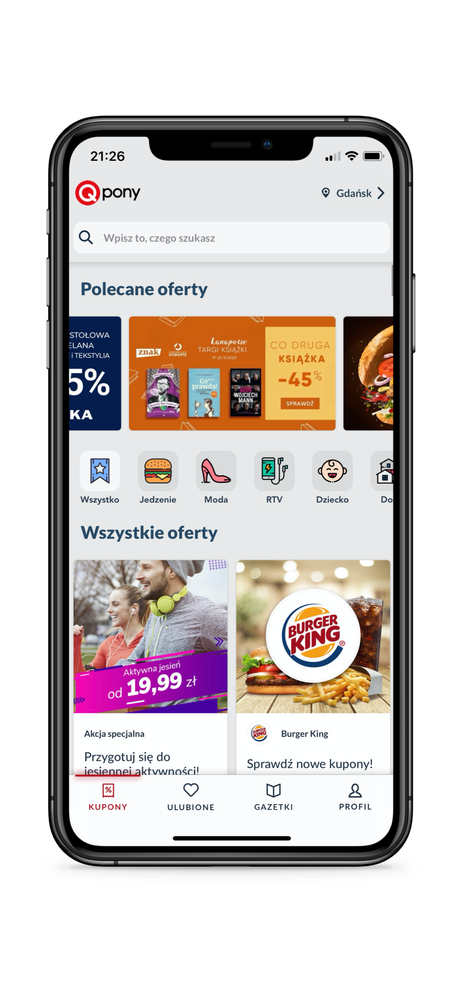
  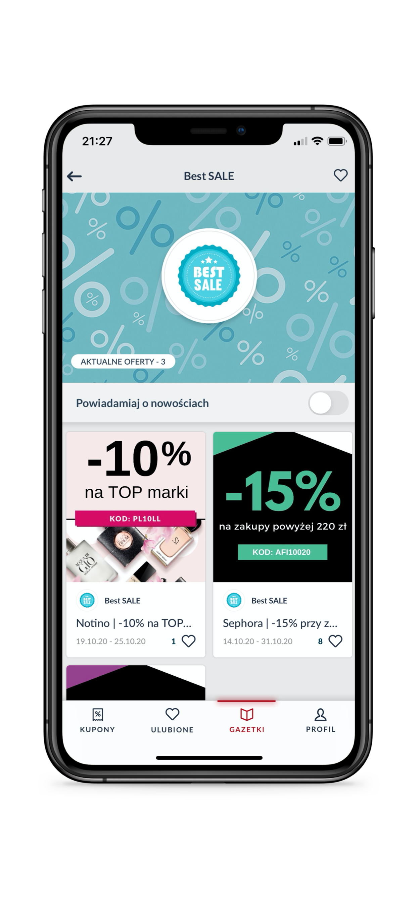
  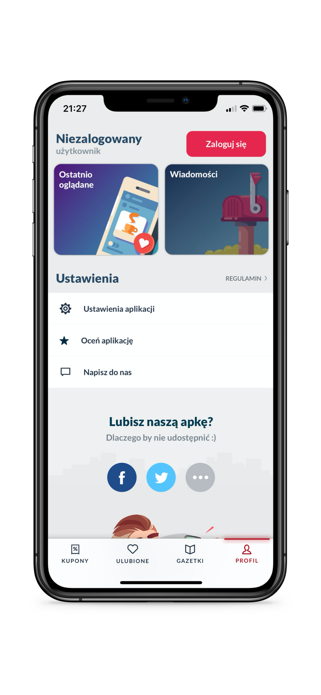

 

## [Blix](https://apps.apple.com/app/blix-gazetki-lista-zakupów/id1012288672)

Blix is a free application with leaflets of the most popular retail chains in Poland and a convenient and simple shopping list. Additionally, thanks to the intelligent product search engine, you can check where you can buy the cheapest product.

This app was a particular challenge, as due to the high MAU (100k+), every new update was a critical moment to make sure that all parts of the app are backwards compatible.

What I've learned:

- **MVC** architecture
- using **Realm** to store and migrate data
- working with **deeplinks** and **Branch.io**
- creating simple lanes with **fastlane**

  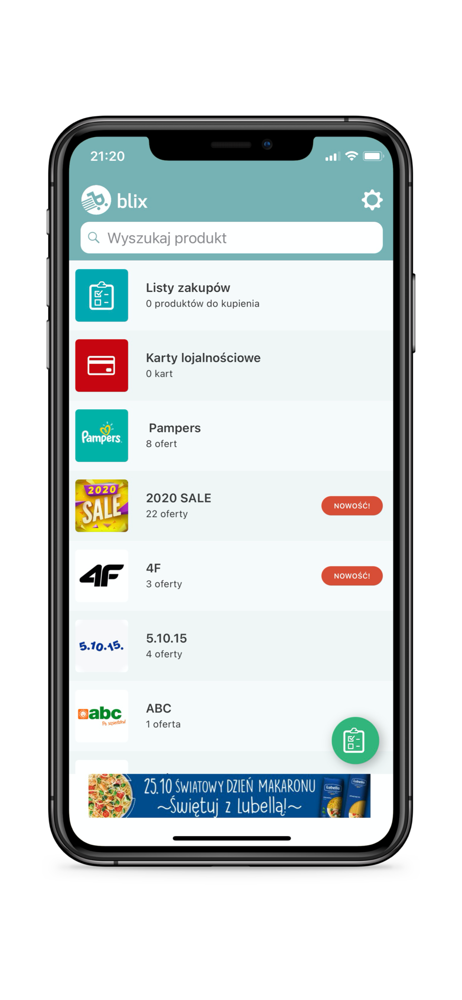
  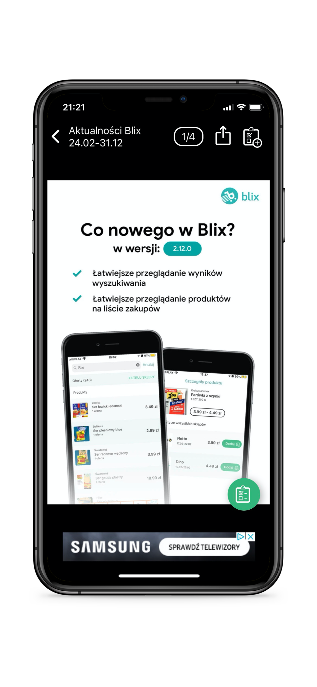
  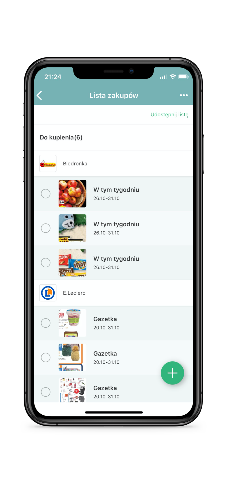

 

## Skidki i Akcii

Skidki i Akcii is a free application that helps users avoid lengthy searches for discounts in supermarkets, leaflets, and on the Internet.

As my first commercial project, I was tasked with cloning the previous app (Blix) for the Ukrainian market - my introduction to how large iOS projects are structured and how to work with applications at that scale.

What I've learned:

- writing commercial apps with **Swift**
- becoming more familiar with **Xcode** and **iOS SDK**
- working with advanced **Auto Layout** and **UIKit**
- implementing **Google Ads**

  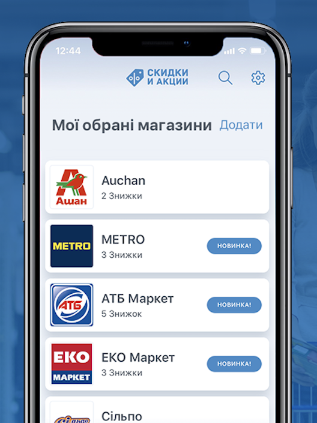

 

# Companies

## [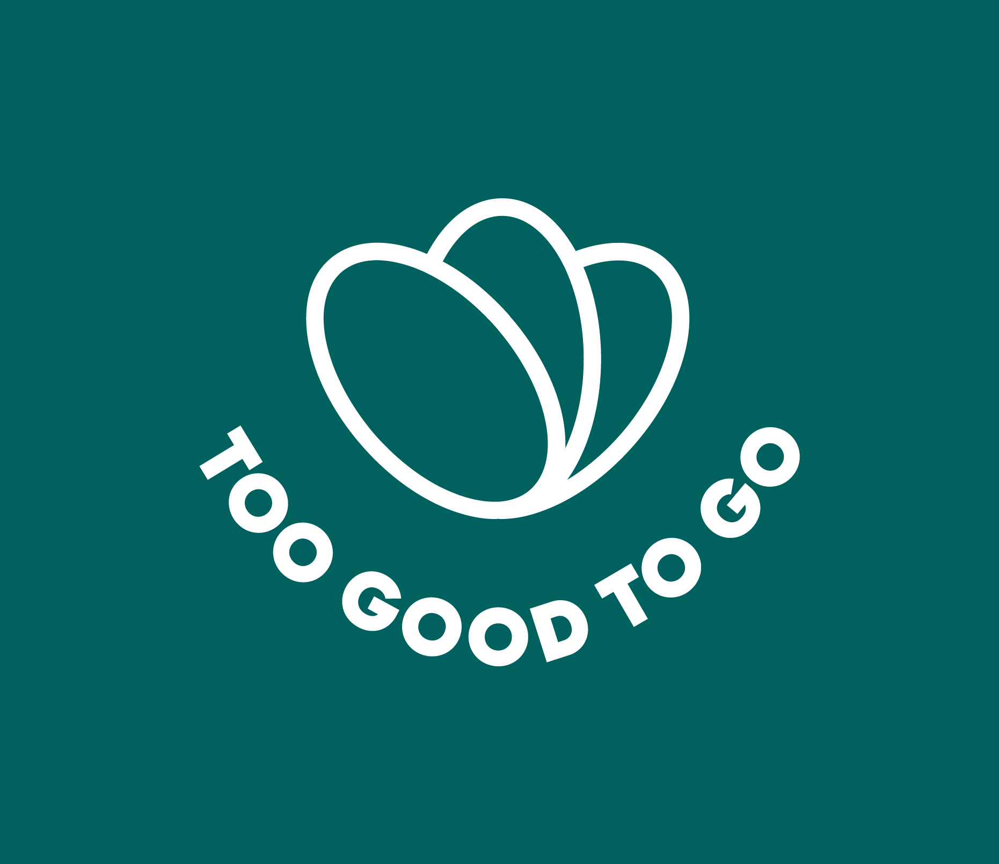](https://www.toogoodtogo.com)

**Senior iOS Software Engineer**, *March 2023 - present*

**Too Good To Go** is a certified B Corp social impact company, on a mission to inspire and empower everyone to fight food waste together.

I joined the product team in March 2023, working on user-facing features including the charity module in the international iOS app. In early 2025, I moved internally to **Foundation** - the platform team responsible for the project as a whole rather than a specific feature set - where my focus shifted from shipping features to building the design system and developer-experience tooling used by the whole iOS team.

My responsibilities:

- co-leading the iOS side of the org-wide design system (also used on Android and web) - with cross-platform contributions to process and tooling
- building out and extending the cross-platform token pipeline that generates platform-specific outputs from Figma Variables, with multi-mode and multi-language support
- setting standards for the iOS team on how to use tokens, build new components, and write snapshot tests
- onboarding the rest of the iOS team into the design system through code reviews, internal documentation, and direct support
- modernizing CI for the design system - release automation, semver detection, and snapshot-testing workflows
- helping define company-wide guidelines for working with AI tools - rules, skills, and good practices

 

## [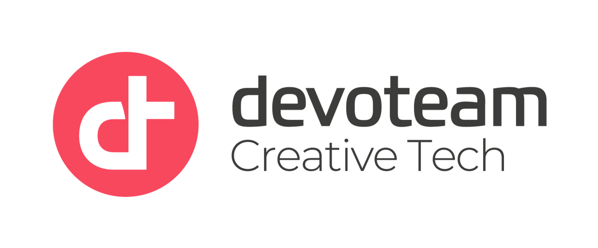](https://creativetech-se.devoteam.com)

**iOS Developer**, *February 2021 - February 2023* (originally **Jayway**, later merged with Devoteam Creative Tech)

**Creative Tech** is an established business unit within Devoteam across the EMEA with more than 1,000 creative technologists in 6 countries. In a world of emerging technologies, we shape performant products and experiences. Turning promising opportunities into powerful realities. Creative tech fuels better change.

My responsibilities:

- iOS consultancy work across long-term engagements, with clients including GN Hearing (Kai onboarding app), Jabra (Sound+), and the Danish Parliament (Folketinget)
- joining a greenfield **SwiftUI** + **Combine** codebase on the Kai project - implementing state-machine-driven user journeys and integrating with a headless CMS
- maintaining and extending a large UIKit codebase as part of a 30+ person Jabra Sound+ product team, including migration to **async/await**
- working with multiple Bluetooth SDKs (**CoreBluetooth**, **GaiaSDK**, **GNP**) for hearing-aid and headphone device communication
- collaborating with international product teams across different client engineering cultures

 

## [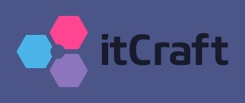](https://itcraftapps.com)

**iOS Developer**, *May 2019 - January 2021*

**itCraft** sp. z o.o. is a team of creative specialists who deliver the highest quality IT solutions with dedication. All the skills we possess enable us to execute projects in areas of banking, insurance, e-commerce solutions and Internet marketing. We are proud to be co-executors of projects for Poland's biggest banks, insurance and telecom companies. 10 years on the market, 200+ completed projects and more than 60 people on board - that’s itCraft in numbers. The main goal of the itCraft team is always to deliver high-quality mobile innovations to businesses around the world.

My responsibilities:

- delivering iOS applications for clients across diverse domains: VoIP/SIP (HiHi Connect 2), social networking, and IoT/maritime (Seaber)
- joining projects at various stages - from greenfield builds to App Store launch and post-release maintenance
- working as the sole iOS developer on smaller projects, owning architecture and delivery end-to-end
- applying patterns and libraries appropriate to each codebase (**MVVM**, **RxSwift**, **CoreData**, **CallKit**, **PushKit**)
- collaborating directly with clients, product owners, and cross-functional teams

 

## [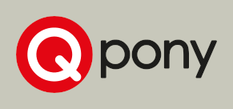](https://www.qpony.pl)

**Junior iOS Developer**, *August 2018 - April 2019*

**Qpony.pl** sp. z o.o. are shopping applications used by over 3,000,000 users, generating tens of millions of sessions per month. By providing marketing solutions to leading brands, manufacturers and retail chains, the company supports sales and conquers the mobile advertising market. Qpony.pl recently became a laureate of the Deloitte "Technology Fast 50 2018 CE" ranking, ranking 15th among the fastest-growing technology companies in Central Europe and 3rd - in the same category - among companies in Poland.

My responsibilities:

- contributing to three live shopping/coupon iOS apps (Qpony, Blix, Skidki i Akcii)
- shipping production updates while maintaining backwards compatibility - especially for Blix, with its 100k+ MAU
- writing **fastlane** lanes for release automation
- working with analytics tooling (**Crashlytics**, **Clevertap**) for release monitoring
- first commercial iOS role - formative period learning Swift, Xcode, **CocoaPods**, and large-scale codebase patterns

 

## 

**System Analyst / IT Support Consultant**, *June 2016 - July 2018*

**Unit4** is an enterprise software company building ERP, HR, and financial management products for the public sector, nonprofits, and education.

My responsibilities:

- providing 2nd-line support across Unit4 enterprise modules (OneVision, UBW HR/Payroll, Workflow, Reporting)
- triaging product bugs and delivering workarounds to lower criticality for affected customers
- bridging customers and R&D - reproducing issues and validating fixes across hotfixes and standard releases
- handling high-priority escalations against customer SLAs
- delivering internal training within the area of expertise

 

# Education

## [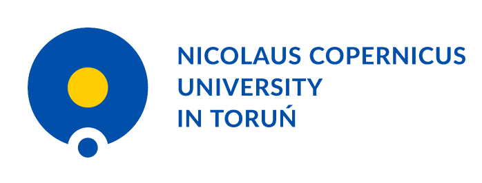](https://www.umk.pl/en)

*October 2012 - June 2017*

**Information Technology**, Engineer's degree 
Thesis project: **TODO** - a web application for managing task lists (yes, the app was literally called "TODO")

 

## Courses

- [**iOS Lead Essentials**](https://www.essentialdeveloper.com/p/ios-lead-essentials/) by Essential Developer - TDD, modular design, Clean Architecture, advanced testing patterns

 

[↑ Back to top](#about-me)
