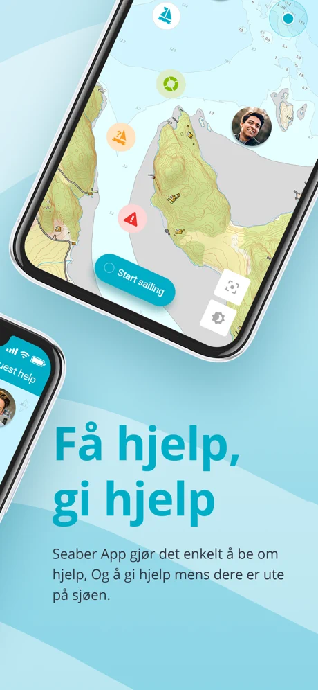

# About me

My name is Adrian and I am an iOS Developer with almost 3 years of experience. I have been a fan of Apple products for as long as I can remember.

At work, I am professional and pay attention to details. I am a well-organized person that enjoys working individually, but is far more excited about being part of a team with people who like to get things done in the most effective way.

Personally, I am a very friendly and conflict-free person. I also love the eco-friendly, zero waste lifestyle, a mindfulness approach and all kinds of animals - I own a cat.

## Contact info

- kwiatkowski.adrian@icloud.com
- [linkedin.com/in/adrian-kwiatkowski](https://www.linkedin.com/in/adrian-kwiatkowski/)

# Apps

## Obostrzenia

The app was supposed to show what are the current governmental restrictions (caused by COVID-19 pandemic) in Poland, based on user's location. Together with my friend, we wrote the **MVP** in **Flutter** and submitted it to the App Store and Google Play.

Unfortunately - due to the fact that this was a personal project rather than a one from a recognized institution, such as a governmental entity or hospital - it got rejected, so we decided to abandon the project.

What I have learned:

- writing simple apps using **Flutter**
- **geolocator** to fetch user's location data
- **permission_handler** to work with user's permissions

  
  

## [HiHi Connect 2](https://apps.apple.com/app/hihi-connect-2/id1532249807)

Application that allows audio and video calling using **Session Initiation Protocol (SIP)**. Users can also store contacts, synchronize them and view their presence (using **XMPP**).

For the first few months of this project I was the only iOS Developer, so I had a chance to find out about the responsibilities and problems that come with such role.

What I have learned:

- integrating **PushKit** into the project to receive VoIP notifications
- working with **CallKit** to handle CXActions
- **Contacts Framework** to access and display contacts stored on the device
- **CoreData** to store and synchronize data fetched from the API (company contacts, calls history)
- **linphoneSDK** - a library that integrates SIP voice/video features

  
  
  

  

## Social networking App

This project was a social network app that allows users to search for groups related to their interests/hobbies and post text, images, videos and links based on their permissions/group access.

What I have learned:

- unidirectional data flow using **Moya**, **Realm** and **RxSwift**
- writing **unit tests** with **Quick** and **Nimble**
- basics of **AVFoundation** to play video
- **UIImagePickerController** to post images
- protocol-oriented programming (POP)

  

## [Seaber](https://apps.apple.com/app/seaber/id1468876155#?platform=iphone)

An award-winning IOT mobile app which allows boat owners to be notified of unauthorised movement of their vessels, with sophisticated map integration and social networking feature.

I joined the project few months before launch date and was involved during the process of submitting it to the App Store, as well as some time after for a post-release maintenance.

What I have learned:

- **MVVM** architecture
- first experience with **RxSwift** and **RxCocoa**
- **SnapKit** as a DSL for **AutoLayout**
- implementing **Stripe** payments

  
  

  

## [Zdrowe Zakupy](https://apps.apple.com/pl/app/zdrowe-zakupy/id1200020785#?platform=iphone)

Zdrowe Zakupy is an application that helps you buy products that do not contain harmful ingredients. After scanning the product's barcode, you can check the specific ingredients and their possible harmfulness.

This was my first chance to work on a project from beginning to launch. Even though it was an app with an established userbase, we decided to start this one from scratch due to the loads of bugs in the legacy code.

What I have learned:

- writing **unit tests** in **XCTest**
- scanning barcodes using **AVCaptureMetadataOutput**
- implementing **Rewarded Video Ads**
- the process of submitting a new app to the **App Store**

  
  
  

## [Qpony](https://apps.apple.com/app/qpony-promocje-kupony-zniżki/id585176404#?platform=iphone)

The most popular discount app in Poland. The best and most up-to-date coupons and leaflets in one application. Here you will find a database of coupons, sales, discounts and promotional leaflets for popular retail chains.

What I have learned:

- network communication with **API** using **Alamofire**
- Push Notifications
- working efficiently with **Git**
- becoming more familiar with **CocoaPods**
- working with analytic tools like **Crashlytics** and **Clevertap**

  
  
  

## [Blix](https://apps.apple.com/app/blix-gazetki-lista-zakupów/id1012288672#?platform=iphone)

Blix is a free application with leaflets of the most popular retail chains in Poland and a convenient and simple shopping list. Additionally, thanks to the intelligent product search engine, you can check where you can buy the cheapest product.

This app was a particular challenge, as due to the high MAU (100k+), every new update was a critical moment to make sure that all parts of the app are backwards compatible.

What I have learned:

- **MVC** architecture
- using **Realm** to store and migrate data
- working with **deeplinks** and **Branch.io**
- creating simple lanes with **fastlane**
- basics of CI/CD using **Xcode Server**

  
  
  

## Skidki i Akcii

Skidki i Akcii is a free application that was created to simplify users life and help to get rid of the long search for discounts in supermarkets, leaflets and on the Internet.

As my first commercial project, I got a task to create it as a clone of the other app described above (Blix), but for the ukrainian market. It was a very didactic project for me as I had a chance to get to know how large projects are structured and how to work with applications this size.

What I have learned:

- writing commercial apps with **Swift**
- becoming more familiar with **Xcode** and **iOS SDK**
- working with advanced **Auto Layout** and **UIKit**
- implementing **Google Ads**

  

## Other skills and tools

- Carthage
- Swift Package Manager
- Terminal
- Scrum
- Bitbucket
- Gitlab
- JIRA
- Confluence

# Companies

## 

*May 2019 - present*

itCraft sp. z o.o. is a team of creative specialists who deliver highest quality IT solutions with dedication. All the skills we possess enable us to execute projects in areas of banking, insurance, e-commerce solutions and Internet marketing. We are proud to be co-executors of projects for Poland’s biggest banks, insurance and telecom companies. 10 years on the market, 200+ completed projects and more than 60 people on board – that’s itCraft in numbers. The main goal of the itCraft team is always to deliver high-quality mobile innovations to businesses around the world.

My responsibilities:

- creation, maintenance and development of mobile applications
- designing the functions of mobile applications with particular emphasis on the efficiency of their construction, ease of maintenance and subsequent development
- cooperation with developers from the team responsible for software development
- care for the quality of the team's work, in particular for: code review, code testing, design patterns, work documentation in the project management tool
- reporting and communicating the progress of work on creating applications for the iOS operating system
- cooperation with a product team, in particular with Product Owners, in the field of product development

 

## 

*August 2018 - April 2019*

Qpony.pl sp. z o.o. are shopping applications used by over 3,000,000 users, generating tens of millions of sessions per month. By providing marketing solutions to leading brands, manufacturers and retail chains, company supports sales and conquer the mobile advertising market. Qpony.pl recently became laureates of the Deloitte "Technology Fast 50 2018 CE" ranking, ranking 15th among the fastest-growing technology companies in Central Europe and 3rd - in the same category - among companies in Poland.

My responsibilities:

- creation, maintenance and development of mobile applications
- designing the functions of mobile applications with particular emphasis on the efficiency of their construction, ease of maintenance and subsequent development
- cooperation with developers from the team responsible for software development
- care for the quality of the team's work, in particular for: code review, code testing, design patterns, work documentation in the project management tool
- reporting and communicating the progress of work on creating applications for the iOS operating system
- cooperation with a product team, in particular with Product Owners, in the field of product development

 

## 

*June 2016 - July 2018*

Unit4’s next-generation enterprise software supports their customers in delivering an exceptional People Experience to their customers – from boosting success for students and professionals, to empowering the public servants and nonprofit teams doing good in the world. They transform work to be more meaningful and inspiring through software that’s self-driving, adaptive and intuitive, intelligently automating administrative tasks and providing easy access to the answers people need.

My responsibilities:

- System Analyst
  - reviewing and confirming product bugs
  - delivering workaround to downgrade critically of a given bug
  - assisting with high priority escalations
  - working closely with customers to understand the criticality of the issue and the business case
  - working closely with R&D developers to fix the issue (either as hotfix or as a part of standard update)
  - testing solutions delivered by the R&D as well as testing new updates/milestones
  - acting as a 2nd Line in the Centre (i.e. within given module as well as cross-module)
  - delivering trainings within the area of expertise

- IT Support Consultant
  - OneVision, UBW HR/Payroll module, Workflow, Reporting
  - Research support requests (SRs) ad provide the customer with a solution, work around or action plan;
  - Keep the customer informed through written and verbal communication, in accordance with the customer's SLA
  - Progress each problem through to conclusion, liaising with colleagues and R&D, as needed whilst retaining ownership of the call
  - Adhere to the processes and procedures within the Customer Services department
  - Escalate issues in a timely manner to the Team Leader
  - Document issues clearly and concisely in the call handling system
  - Comply with Company's information and Security Requirements and all Company business procedures, policies and ISO/BS standards
  - Identify opportunities for the service improvement or chargeable activities and to raise these via the appropriate channels

# Education

 
*October 2012 - June 2017*

**Information Technology**, Engineer’s degree 
Project: *"TODO" - Web application that allows users to create task lists*
