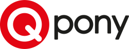

# About me

My name is Adrian and I am an iOS Developer with 7+ years of experience. During this time I have worked on a number of projects from within different business areas (mainly shopping, social, utility and telecom apps). I have been a fan of Apple products for as long as I can remember.

At work, I am professional and pay attention to details. I am a well-organized person that enjoys working individually, but is far more excited about being a part of a team with people who like to get things done in the most effective and simple way. I love modern, minimalistic design and good User Experience. 

My commercial iOS Development journey has started in a company that manages the largest shopping/coupon apps in Poland and there I gained experience working with large scale apps (100k+ MAU). During that time I also learned how to work with e.g. Firebase, Realm, fastlane. Also, this was the time when I got to know how to work in Scrum and Kanban. Then, for around 1,5 years I was working in a software house and learned basics of reactive programming (RxSwift) and also expanded my skills in application architecture.

In the beginning of 2021, I moved to Copenhagen and started working in Jayway on the GN Kai project - a companion app that helps onboard people to a new experience of using hearing aid. This app was written entirely using Apple's new UI framework - SwiftUI. Later that year I joined Jabra Sound+ team where I learned the basics of the new Swift Concurrency framework (async await).

Personally, I am a very friendly and conflict-free person. I also love the eco-friendly, zero waste lifestyle, a mindfulness approach and all kinds of animals.

## Contact info

- kwiatkowski.adrian@icloud.com
- [linkedin.com/in/adrian-kwiatkowski](https://www.linkedin.com/in/adrian-kwiatkowski/)

### Quick jump to:
- [projects](#apps)
- [skills](#other-skills-and-tools)
- [employers](#companies)
- [education](#education)

# Apps

## Too Good To Go

Too Good To Go makes it easy to make a positive impact on the planet while saving money on your favourite foods.
That's why it's been named as Winner in the '2023 Cultural Impact' category at the prestigious annual Apple App Store Awards. With the #1 app for reducing food waste, you can save tasty unsold snacks, takeaway meals and ingredients straight from shops, cafes, grocery stores and restaurants in your area - all at an unbeatable price.

  
  
  

## Folketinget

An app which allows the members of danish parliament to better manage their everyday activities and obtain the right information for the meetings and committees they attend to. This was an iPad only app.

What I've learned:

- basics of **VIPER** architecture
- working with documents using **QuickLook**
- making **SOAP requests** with iOS networking API

 

## Jabra Sound+

The Jabra Sound+ app is the perfect companion for your Jabra headphones – adding extra features and enabling you to personalize the way you use your Jabra headphones.

I was a part of a team of 10+ iOS developers working on a large codebase - this one was an interesting experience in itself. I was responsible for maintaining the old code, adding new features and support for new devices.

What I've learned:

- basics of bluetooth connectivity and communication using **GaiaSDK**, **GNP** and **CoreBluetooth**
- writing code that uses **Async await**
- working in a large product team (30+ people)

  
  
  

 

## Kai

New onboarding solution to help new hearing aid users adapt to their new lives and to get familiar with their new devices. **Azure** cloud was used for backend. App content and user journeys managed in an open source **headless CMS (Strapi)**.

iOS version of the app was written entirely using **SwiftUI** and **Combine**. 

What I've learned:

- working with **State Machine** concept
- using **SwiftUI** to create views
- **Combine** framework to pass the data between components

  
  
  

 

## Obostrzenia

The app was supposed to show what are the current governmental restrictions (caused by COVID-19 pandemic) in Poland, based on user's location. Together with my friend, we wrote the **MVP** in **Flutter** and submitted it to the App Store and Google Play.

Unfortunately - due to the fact that this was a personal project rather than a one from a recognized institution, such as a governmental entity or hospital - it got rejected, so we decided to abandon the project.

What I've learned:

- writing simple apps using **Flutter**
- **geolocator** to fetch user's location data
- **permission_handler** to work with user's permissions

  
  

 

## [HiHi Connect 2](https://apps.apple.com/app/hihi-connect-2/id1532249807)

Application that allows audio and video calling using **Session Initiation Protocol (SIP)**. Users can also store contacts, synchronize them and view their presence (using **XMPP**).

For the first few months of this project I was the only iOS Developer, so I had a chance to find out about the responsibilities and problems that come with such role.

What I've learned:

- integrating **PushKit** into the project to receive VoIP notifications
- working with **CallKit** to handle CXActions
- **Contacts Framework** to access and display contacts stored on the device
- **CoreData** to store and synchronize data fetched from the API (company contacts, calls history)
- **linphoneSDK** - a library that integrates SIP voice/video features

  
  
  

 

## Social networking App

This project was a social network app that allows users to search for groups related to their interests/hobbies and post text, images, videos and links based on their permissions/group access.

What I've learned:

- unidirectional data flow using **Moya**, **Realm** and **RxSwift**
- writing **unit tests** with **Quick** and **Nimble**
- basics of **AVFoundation** to play video
- **UIImagePickerController** to post images
- protocol-oriented programming (POP)

 

## [Seaber](https://apps.apple.com/app/seaber/id1468876155#?platform=iphone)

An award-winning IOT mobile app which allows boat owners to be notified of unauthorised movement of their vessels, with sophisticated map integration and social networking feature.

I joined the project few months before launch date and was involved during the process of submitting it to the App Store, as well as some time after for a post-release maintenance.

What I've learned:

- **MVVM** architecture
- first experience with **RxSwift** and **RxCocoa**
- **SnapKit** as a DSL for **AutoLayout**
- implementing **Stripe** payments

  
  

 

## [Zdrowe Zakupy](https://apps.apple.com/pl/app/zdrowe-zakupy/id1200020785#?platform=iphone)

Zdrowe Zakupy is an application that helps you buy products that do not contain harmful ingredients. After scanning the product's barcode, you can check the specific ingredients and their possible harmfulness.

This was my first chance to work on a project from beginning to launch. Even though it was an app with an established userbase, we decided to start this one from scratch due to the loads of bugs in the legacy code.

What I've learned:

- writing **unit tests** in **XCTest**
- scanning barcodes using **AVCaptureMetadataOutput**
- implementing **Rewarded Video Ads**
- the process of submitting a new app to the **App Store**

  
  
  

 

## [Qpony](https://apps.apple.com/app/qpony-promocje-kupony-zniżki/id585176404#?platform=iphone)

The most popular discount app in Poland. The best and most up-to-date coupons and leaflets in one application. Here you will find a database of coupons, sales, discounts and promotional leaflets for popular retail chains.

What I've learned:

- network communication with **API** using **Alamofire**
- Push Notifications
- working efficiently with **Git**
- becoming more familiar with **CocoaPods**
- working with analytic tools like **Crashlytics** and **Clevertap**

  
  
  

 

## [Blix](https://apps.apple.com/app/blix-gazetki-lista-zakupów/id1012288672#?platform=iphone)

Blix is a free application with leaflets of the most popular retail chains in Poland and a convenient and simple shopping list. Additionally, thanks to the intelligent product search engine, you can check where you can buy the cheapest product.

This app was a particular challenge, as due to the high MAU (100k+), every new update was a critical moment to make sure that all parts of the app are backwards compatible.

What I've learned:

- **MVC** architecture
- using **Realm** to store and migrate data
- working with **deeplinks** and **Branch.io**
- creating simple lanes with **fastlane**
- basics of CI/CD using **Xcode Server**

  
  
  

 

## Skidki i Akcii

Skidki i Akcii is a free application that was created to simplify users life and help to get rid of the long search for discounts in supermarkets, leaflets and on the Internet.

As my first commercial project, I got a task to create it as a clone of the other app described above (Blix), but for the ukrainian market. It was a very didactic project for me as I had a chance to get to know how large projects are structured and how to work with applications this size.

What I've learned:

- writing commercial apps with **Swift**
- becoming more familiar with **Xcode** and **iOS SDK**
- working with advanced **Auto Layout** and **UIKit**
- implementing **Google Ads**

  

 

## Other skills and tools

- Carthage
- Swift Package Manager
- Terminal
- Scrum
- Bitbucket
- Gitlab
- JIRA
- Confluence

# Companies

# 

*March 2023 - present*

Too Good To Go is a certified B Corp social impact company, on a mission to inspire and empower everyone to fight food waste together.

My responsibilities:

- developing new features, whilst maintaining and improving existing code for the international Too Good To Go iOS app
- releasing new versions and continuously monitoring app performance and detecting areas for improvement
- keeping user experience at the forefront of work, at all times
- actively participating in team’s agile development processes with a continuous improvement mindset
- striving to deliver top-class international products with maximum quality, maintainability and scalability
- taking on additional tasks outside current boundaries with help from team to continue to grow and expand skills

 

# 

*February 2021 - February 2023*

Creative Tech is an established business unit within Devoteam across the EMEA with more than 1.000 creative technologists in 6 countries. In a world of emerging technologies, we shape performant products and experiences. Turning promising opportunities into powerful realities. Creative tech fuels better change.

My responsibilities:

Consultancy within software development and advice on software solutions within the field of software engineering, predominantly, but not limited to, development mobile applications on the iOS platform.

 

# 

*May 2019 - January 2021*

itCraft sp. z o.o. is a team of creative specialists who deliver highest quality IT solutions with dedication. All the skills we possess enable us to execute projects in areas of banking, insurance, e-commerce solutions and Internet marketing. We are proud to be co-executors of projects for Poland’s biggest banks, insurance and telecom companies. 10 years on the market, 200+ completed projects and more than 60 people on board – that’s itCraft in numbers. The main goal of the itCraft team is always to deliver high-quality mobile innovations to businesses around the world.

My responsibilities:

- creation, maintenance and development of mobile applications
- designing the functions of mobile applications with particular emphasis on the efficiency of their construction, ease of maintenance and subsequent development
- cooperation with developers from the team responsible for software development
- care for the quality of the team's work, in particular for: code review, code testing, design patterns, work documentation in the project management tool
- reporting and communicating the progress of work on creating applications for the iOS operating system
- cooperation with a product team, in particular with Product Owners, in the field of product development

 

# 

*August 2018 - April 2019*

Qpony.pl sp. z o.o. are shopping applications used by over 3,000,000 users, generating tens of millions of sessions per month. By providing marketing solutions to leading brands, manufacturers and retail chains, company supports sales and conquer the mobile advertising market. Qpony.pl recently became laureates of the Deloitte "Technology Fast 50 2018 CE" ranking, ranking 15th among the fastest-growing technology companies in Central Europe and 3rd - in the same category - among companies in Poland.

My responsibilities:

- creation, maintenance and development of mobile applications
- designing the functions of mobile applications with particular emphasis on the efficiency of their construction, ease of maintenance and subsequent development
- cooperation with developers from the team responsible for software development
- care for the quality of the team's work, in particular for: code review, code testing, design patterns, work documentation in the project management tool
- reporting and communicating the progress of work on creating applications for the iOS operating system
- cooperation with a product team, in particular with Product Owners, in the field of product development

 

# 

*June 2016 - July 2018*

Unit4’s next-generation enterprise software supports their customers in delivering an exceptional People Experience to their customers – from boosting success for students and professionals, to empowering the public servants and nonprofit teams doing good in the world. They transform work to be more meaningful and inspiring through software that’s self-driving, adaptive and intuitive, intelligently automating administrative tasks and providing easy access to the answers people need.

My responsibilities:

- System Analyst
  - reviewing and confirming product bugs
  - delivering workaround to downgrade critically of a given bug
  - assisting with high priority escalations
  - working closely with customers to understand the criticality of the issue and the business case
  - working closely with R&D developers to fix the issue (either as hotfix or as a part of standard update)
  - testing solutions delivered by the R&D as well as testing new updates/milestones
  - acting as a 2nd Line in the Centre (i.e. within given module as well as cross-module)
  - delivering trainings within the area of expertise

- IT Support Consultant
  - OneVision, UBW HR/Payroll module, Workflow, Reporting
  - Research support requests (SRs) ad provide the customer with a solution, work around or action plan;
  - Keep the customer informed through written and verbal communication, in accordance with the customer's SLA
  - Progress each problem through to conclusion, liaising with colleagues and R&D, as needed whilst retaining ownership of the call
  - Adhere to the processes and procedures within the Customer Services department
  - Escalate issues in a timely manner to the Team Leader
  - Document issues clearly and concisely in the call handling system
  - Comply with Company's information and Security Requirements and all Company business procedures, policies and ISO/BS standards
  - Identify opportunities for the service improvement or chargeable activities and to raise these via the appropriate channels

# Education

# 

*October 2012 - June 2017*

**Information Technology**, Engineer’s degree 
Project: *"TODO" - Web application that allows users to create task lists*
